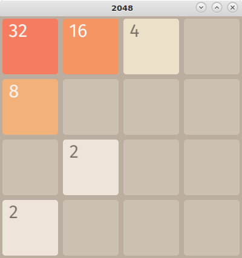

2048 in Rust
============

This is a clone of the popular "2048" game written in Rust using the [Piston][1] game engine.

---------
This project is released under the MIT license. See LICENSE for further information.
The font "FiraSans", which is used in this project, is licensed under SIL OPEN FONT LICENSE Version 1.1. See LICENSE file in the `assets` folder for more information.

[1]: https://github.com/PistonDevelopers/piston
